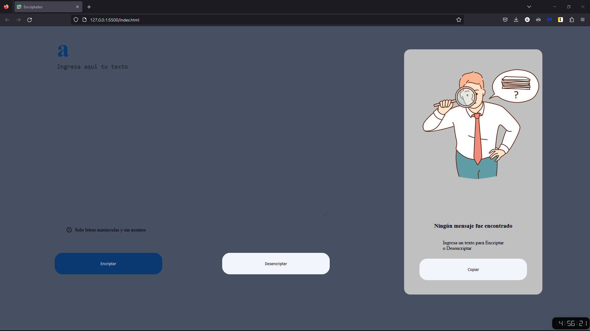
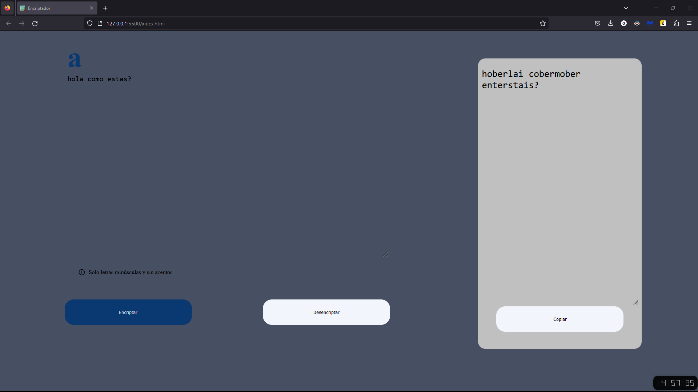
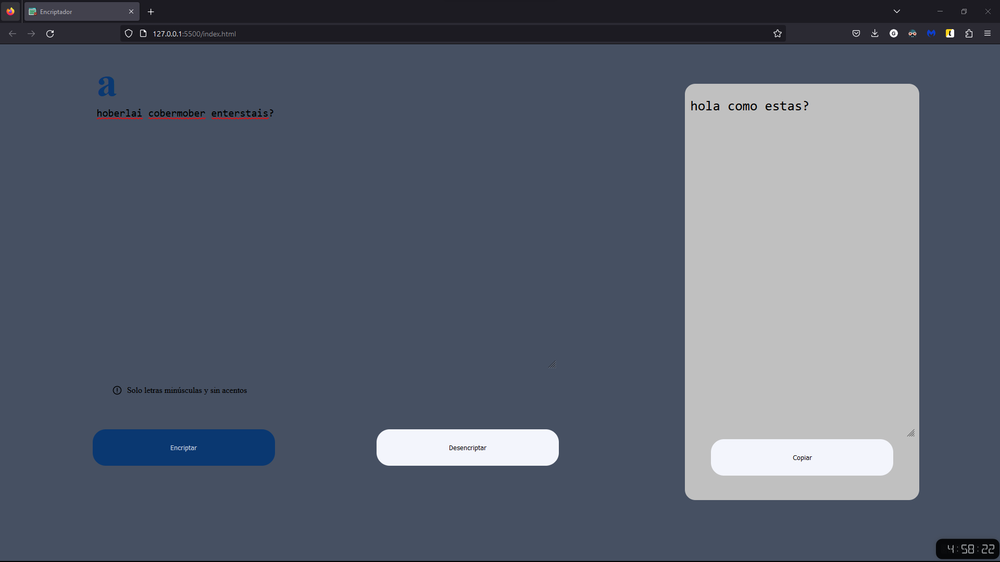

# Challenge ONE | La lógica de programación | Encriptador

Solución aplicada por mí para el desafío hecho por el Equipo de Alura y el programa ONE, donde se nos pidió que creáramos un encriptador y de esta forma trabajar con nuestra lógica de programación.

### Funciones

Tenemos las funciones donde se puede encriptar, desencriptar y copiar el texto encriptado.

### Encriptar

### Desencriptar

